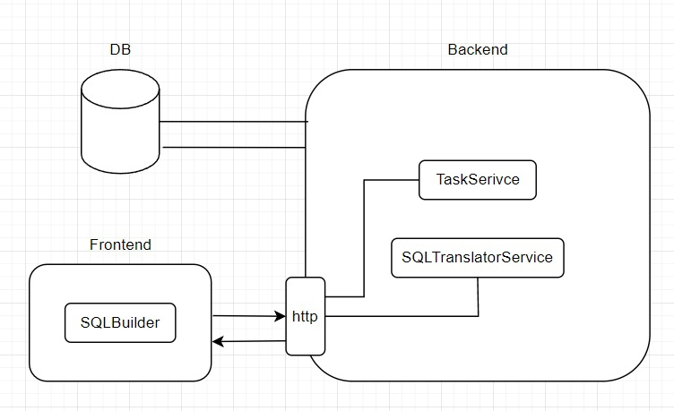

# SQL-builder
Данный проект представляет собой приложение, цель 
которого заключается в обучении SQL запросам при помощи визуального 
программирования. 
Визуальное программирование реализовно в виде web-приложения на 
языке программирования JavaScript и представляет собой манипуляцию 
графическими элементами (блоками), которые заменяют текстовые команды. 
Полученные блочные структуры передаются в формате JSON в API 
разработанную на языке C#, где из полученных данных формируется код 
запроса SQL и результат передается обратно в web-приложение.

## Концепт
Данный проект нацелен на аудиторию людей, которые хотят изучить и 
закрепить знания языка запросов SQL. С помощью данного сервиса 
пользователи смогут создавать запросы при помощи графических элементов, 
вместо текстовых команд, что упростит задачу набора запроса. Основным 
видом занятия будет решение задач, направленных на различные аспекты 
языка запросов SQL.

Интерфейс приложения представляет собой 4 блока: блок задания, 
меню с выбором графических элементов, поле (холст) для размещения 
блоков и блок с результатом в виде текстового запроса на языке SQL. Блок 
задания расположен в верхней части экрана, чтобы пользователю было 
проще воспринимать информацию, в нем будет описываться задание, 
которое пользователю будет необходимо реализовать из блоков. Меню 
расположено в левой части экрана, в котором представлен список доступных 
пользователю графических элементов, эквивалентных текстовым командам 
языка запросов SQL. Блок холста занимает наибольшее пространства и 
расположен в центре экрана, на нем пользователи могут свободно 
манипулировать графическими элементами, которые могу объединяться в 
структуры. Блок с результатом будет отображен после того, как пользователь 
подтвердит готовность.
Пользователи могут выбирать блоки из меню и размещать их на поле, 
где из них могу составлять структуры, которые будут переводится в язык 
запросов SQL.

|  |
|:--:| 
| *Структура проекта* |
